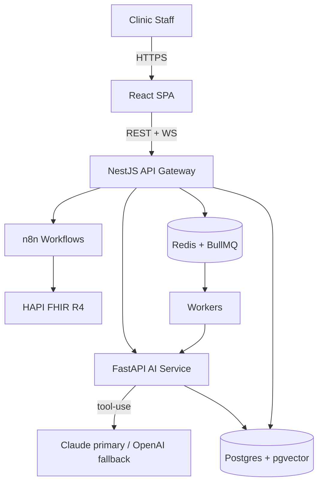

# 06 · Architecture & Scalability

## System architecture (overview)

ClinicPilot is a **multi-tenant, service-oriented** system: a React SPA talks to a NestJS API gateway (auth, tenancy, orchestration entrypoint), which delegates AI reasoning to a Python FastAPI service and side-effect execution to n8n. Postgres is the system of record, Redis powers caching + queues, and FHIR is the EHR interface.

### ASCII diagram

```
                                   ┌───────────────────────────────┐
                                   │        Clinic Staff (RBAC)     │
                                   │  Admin · Clinician · Coord ·   │
                                   │            Viewer              │
                                   └───────────────┬───────────────┘
                                                   │ HTTPS
                                        ┌──────────▼──────────┐
                                        │   React SPA (Vite)  │
                                        │  Dashboard · Traces │
                                        └──────────┬──────────┘
                                        REST + WebSocket/SSE
                                                   │
                            ┌──────────────────────▼───────────────────────┐
                            │        API Gateway  —  NestJS (Node/TS)       │
                            │  Auth/OIDC · Tenancy · RBAC guards · Audit ·  │
                            │  CRUD · WebSocket hub · Orchestrator entry    │
                            └───┬───────────────┬──────────────────┬────────┘
                                │               │                  │
                 enqueue task   │        REST   │           events │  (BullMQ / Redis)
                                ▼               ▼                  ▼
                     ┌────────────────┐  ┌──────────────┐  ┌───────────────────┐
                     │  Redis + BullMQ│  │  AI Service  │  │  n8n (self-hosted) │
                     │  queues+cache  │  │  FastAPI (Py)│  │  workflow engine   │
                     └───────┬────────┘  │  Claude loop │  │  400+ integrations │
                             │           │  RAG·redact  │  └─────────┬─────────┘
                             │           │  evals·cost  │            │ webhooks
                     workers │           └──────┬───────┘            │
                             │                  │  tool calls        │
                             │            ┌─────▼─────┐        ┌──────▼───────┐
                             │            │ Claude API│        │  FHIR R4     │
                             │            │ (primary) │        │  HAPI server │
                             │            │ OpenAI    │        │  (sandbox)   │
                             │            │ (fallback)│        └──────────────┘
                             ▼            └───────────┘
                   ┌────────────────────────────────────────────┐
                   │   PostgreSQL + pgvector  (system of record) │
                   │   tenants · users · agents · tasks · traces │
                   │   audit_log · embeddings · workflow_runs    │
                   └────────────────────────────────────────────┘

     Cross-cutting:  OpenTelemetry traces · Prometheus/Grafana metrics · structured logs
```

### Request lifecycle (a scheduling task)
1. Task arrives (UI simulator / webhook) → API gateway authenticates, resolves **tenant**, checks RBAC, writes an **audit** entry, enqueues a job (BullMQ).
2. A worker hands the task to the **AI service**. Claude runs the **tool-use loop**; PHI is redacted before the model sees it.
3. Tools resolve via **n8n webhooks** (read `Slot`/`Appointment` from **HAPI FHIR**, write the updated `Appointment`, send confirmation).
4. Each step is persisted as a **trace** and streamed to the UI over WebSocket; token usage → **cost** rows.
5. On low confidence / out-of-scope → **escalation** to the human queue.

### Mermaid (for the README/diagram render)


---

## Monorepo folder structure

Managed with **pnpm workspaces + Turborepo** (shared types between web and API is a nice signal).

```
clinicpilot/
├── apps/
│   ├── web/                      # React 18 + Vite SPA
│   │   ├── src/
│   │   │   ├── app/              # routing, providers
│   │   │   ├── features/         # fleet, agents, tasks, analytics, audit, fhir
│   │   │   ├── components/       # shadcn/ui-based components
│   │   │   ├── hooks/            # TanStack Query hooks
│   │   │   ├── lib/              # api client, ws client, utils
│   │   │   └── styles/
│   │   └── vite.config.ts
│   │
│   ├── api/                      # NestJS API gateway (Node/TS)
│   │   ├── src/
│   │   │   ├── auth/             # OIDC/JWT, sessions
│   │   │   ├── tenancy/          # tenant context, RLS middleware
│   │   │   ├── rbac/             # roles, guards, policies
│   │   │   ├── agents/           # agent CRUD, config, lifecycle
│   │   │   ├── tasks/            # task intake, queue producers
│   │   │   ├── orchestrator/     # routing to AI service, hand-off rules
│   │   │   ├── workflows/        # n8n integration, webhooks
│   │   │   ├── analytics/        # metrics, cost aggregation
│   │   │   ├── audit/            # audit log service (append-only)
│   │   │   ├── realtime/         # WebSocket/SSE hub
│   │   │   └── common/           # filters, interceptors, config
│   │   └── test/
│   │
│   └── ai/                       # Python FastAPI AI/agent service
│       ├── app/
│       │   ├── agents/           # scheduling, followup, docqa
│       │   ├── orchestration/    # tool-use loop, reflection, fallback
│       │   ├── llm/              # provider interface (claude, openai)
│       │   ├── rag/              # embeddings, pgvector retrieval
│       │   ├── safety/           # PHI redaction / de-identification
│       │   ├── tools/            # fhir tools, n8n triggers
│       │   ├── evals/            # eval harness + datasets
│       │   └── main.py
│       └── tests/
│
├── packages/
│   ├── shared-types/             # TS types shared web <-> api (zod schemas)
│   ├── fhir-client/              # typed FHIR R4 client + EHR adapter interface
│   ├── ui/                       # shared shadcn components (optional)
│   └── config/                   # eslint, tsconfig, tailwind presets
│
├── workflows/                    # exported n8n workflow JSON (version-controlled)
├── infra/
│   ├── docker/                   # Dockerfiles per service
│   ├── docker-compose.yml        # full local stack
│   └── db/                       # migrations, seed (synthetic tenants/agents)
├── docs/
│   ├── adr/                      # architecture decision records
│   └── diagrams/
├── .github/workflows/            # CI: lint, typecheck, test, build, deploy
├── turbo.json
├── pnpm-workspace.yaml
└── README.md
```

---

## Data model sketch

Core tables (Postgres). Every tenant-scoped table carries a `tenant_id` and is protected by **Row-Level Security**.

```
tenants(id, name, plan, created_at)
users(id, tenant_id, email, name, mfa_enabled, created_at)
roles(id, name)                              -- admin, clinician, coordinator, viewer
user_roles(user_id, role_id, tenant_id)
agents(id, tenant_id, type, name, status, config_jsonb, version, updated_at)
agent_versions(id, agent_id, version, config_jsonb, created_by, created_at)
tasks(id, tenant_id, agent_id, channel, input, status, outcome, created_at, resolved_at)
traces(id, task_id, tenant_id, step_no, kind, content_jsonb, tokens_in, tokens_out,
       cost_usd, latency_ms, created_at)      -- kind: reason|tool_call|observation|action
escalations(id, task_id, tenant_id, reason, assigned_to, status, created_at)
workflow_runs(id, tenant_id, agent_id, n8n_execution_id, status, started_at, finished_at)
embeddings(id, tenant_id, source_ref, chunk, embedding vector(1536))   -- pgvector
audit_log(id, tenant_id, actor_id, action, resource_type, resource_id,
          metadata_jsonb, ip, created_at)     -- append-only, immutable
fhir_cache(tenant_id, resource_type, resource_id, payload_jsonb, fetched_at)
llm_usage(id, tenant_id, agent_id, model, tokens_in, tokens_out, cost_usd, created_at)
```

Key relationships: `tenant 1—* users/agents/tasks`; `agent 1—* tasks 1—* traces`; `task 0—1 escalation`; `agent 1—* workflow_runs`. `audit_log` is append-only (no update/delete) to model HIPAA audit-control expectations.

---

## Multi-tenancy approach

Research shows healthcare compliance often pushes toward stronger isolation, and a common, cost-effective pattern is **shared-schema for standard tenants + dedicated schema/DB as a premium upsell** ([Medium — multi-tenant patterns](https://medium.com/@arunseetharaman/multi-tenant-saas-architecture-a-deep-dive-into-database-patterns-281320fd8816), [developers.dev](https://www.developers.dev/tech-talk/multi-tenant-database-architecture-a-guide-to-isolation-patterns-and-scaling-trade-offs.html)).

**Chosen model: Pool (shared DB) + PostgreSQL Row-Level Security, with a documented upgrade path to Bridge (schema-per-tenant) and Silo (DB-per-tenant).**

| Tier | Isolation | When |
|------|-----------|------|
| **Pool + RLS** (default / demo) | `tenant_id` on every row; Postgres RLS policies enforce isolation at the DB layer | Fast to build, cheapest, proves the concept; RLS = defense in depth beyond app checks |
| **Bridge (schema-per-tenant)** | One schema per tenant in a shared instance | Mid-size tenants needing stronger logical isolation |
| **Silo (DB-per-tenant)** | Dedicated database/instance | Enterprise/regulated tenants; eliminates the "noisy neighbor" problem ([developers.dev](https://www.developers.dev/tech-talk/multi-tenant-database-architecture-a-guide-to-isolation-patterns-and-scaling-trade-offs.html)) |

Why RLS as the default: it enforces tenant isolation **at the database**, so an app-layer bug can't leak cross-tenant data — a defensible, senior-level choice for healthcare. The trade-off (migrations across many schemas become deployment risk at scale — noted in the research) is precisely why we keep Pool as default and treat schema/DB isolation as an upsell path, not day-one complexity. This is documented in **ADR-005**.

---

## Scalability

Claims below are grounded in the researched multi-tenant/scaling patterns; the design is built to **scale horizontally with tenant count and task volume**.

### 1. Stateless services → horizontal scaling
- API gateway and AI service are **stateless** (session/state in Redis + Postgres), so they scale out behind a load balancer by adding replicas.
- **Workers** (BullMQ consumers) scale independently from the API — the AI/tool-use work is the heavy part and can be scaled on its own.

### 2. Queues absorb spikes (BullMQ / Redis)
- Agent tasks and workflow triggers are **queued**, not run inline, decoupling request rate from processing rate and smoothing bursty inbound volume (e.g., morning appointment rushes).
- Dead-letter + retry handling for resilient side effects (FHIR writes, SMS).

### 3. Caching (Redis)
- Cache **FHIR reads** (patient/appointment lookups) and hot config to cut latency and respect EHR rate limits.
- Cache embeddings/retrieval results for repeated Document Q&A queries.
- Session and RBAC-decision caching.

### 4. Database scaling
- **Read replicas** for analytics/reporting to keep OLTP paths fast.
- **Indexing + partitioning** of high-volume tables (`traces`, `audit_log`, `llm_usage`) by `tenant_id` / time.
- **Connection pooling** (PgBouncer) for many concurrent tenants.
- Upgrade path to **schema/DB-per-tenant** for the largest tenants (removes noisy-neighbor risk per the research).
- pgvector for RAG now; documented swap to a dedicated vector DB (Qdrant/Pinecone) if vector volume outgrows Postgres.

### 5. LLM-cost & throughput scaling
- **Model tiering**: cheap/fast model (Haiku-class) for routing/simple steps, stronger model (Sonnet-class) for complex reasoning — controls cost at volume.
- **Prompt caching + response caching** for repeated contexts.
- **Batching / concurrency limits** per tenant to protect rate limits and budgets.
- Per-tenant **usage metering** enables fair-use and billing.

### 6. Multi-agent orchestration scaling
- Orchestration patterns (sequential/parallel/hierarchical/event-driven) chosen per workflow; parallelizable steps fan out across workers ([Accelirate](https://www.accelirate.com/llm-agent-orchestration/)).
- Enterprise demand context: Gartner reported multi-agent-system inquiries rose **1,445% from Q1 2024 to Q2 2025**, projecting **40% of enterprise apps** will include AI agents by end of 2026 ([Accelirate](https://www.accelirate.com/llm-agent-orchestration/)) — i.e., the orchestration layer is where the value (and the scaling challenge) concentrates.

### 7. Observability at scale
- **OpenTelemetry** traces across API → AI → n8n → FHIR; **Prometheus/Grafana** for metrics (queue depth, p95 latency, error/cost rates); structured logs.
- Anomaly alerts on cost/error spikes.

### Scaling targets (illustrative design goals)
| Dimension | Design target |
|-----------|---------------|
| Tenants | 500+ on Pool+RLS before mandating schema/DB isolation |
| Concurrent agent tasks | Scale linearly by adding workers |
| p95 task latency (excl. LLM) | < 300 ms API path |
| FHIR read cache hit rate | > 70% for repeated lookups |
| Cost visibility | Per-task, per-agent, per-tenant, real-time |
